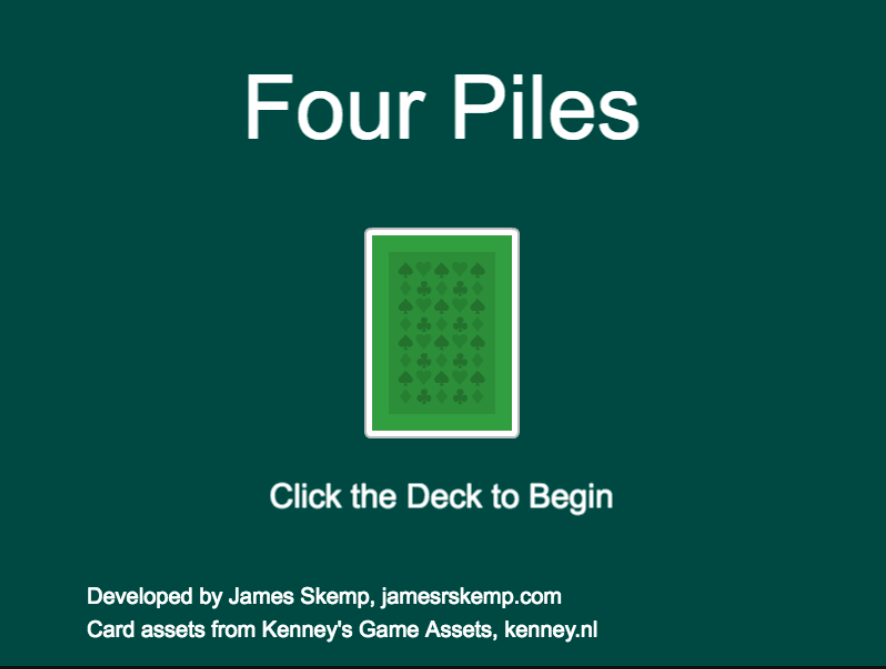

# Four Piles (aka Game Idea 45)

Released February 3, 2017 to https://strivinglife.gitlab.io/phaser-games/four-piles/.

## Resources
- Playing cards from Kenney's [Game Assets](https://kenney.itch.io/kenney-donation)
- [Typescript Playing Cards: A kernel for various sorting and gaming ideas](http://trevorgk.js.org/2015/07/03/modelling-playcards-using-typescript/)
